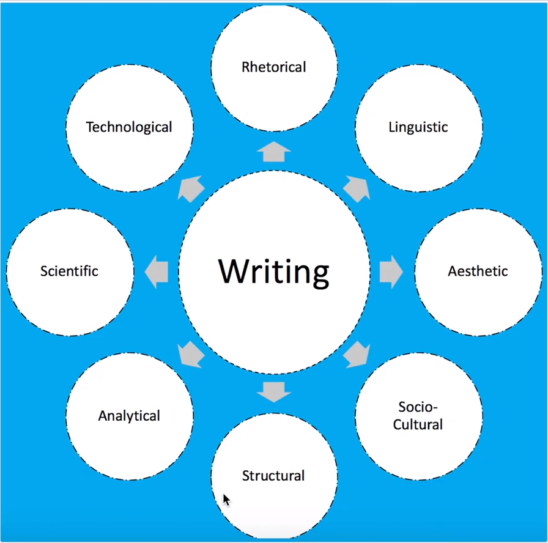
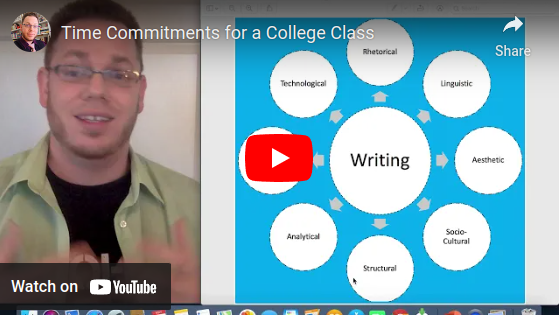
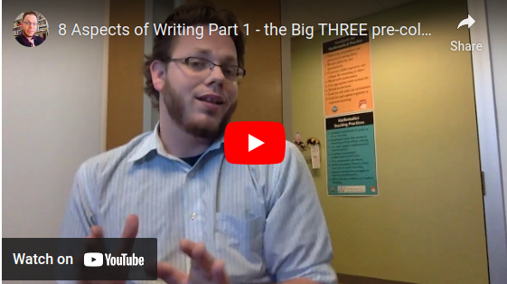

# Module 0 - Writing Fundamentals

<!-- TOC -->
* [Module 0 - Writing Fundamentals](#module-0---writing-fundamentals)
* [General Notes](#general-notes)
  * [Aspects of Writing](#aspects-of-writing)
* [Time Commitments](#time-commitments)
* [8 Aspects of Writing - Top 3](#8-aspects-of-writing---top-3)
  * [Aesthetic](#aesthetic)
  * [Linguistic](#linguistic)
  * [Rhetorical](#rhetorical)
* [Failure as a Process of Writing - Naming What We Know by Brooke and Carr](#failure-as-a-process-of-writing---naming-what-we-know-by-brooke-and-carr)
<!-- TOC -->

# General Notes

## Aspects of Writing

# Time Commitments

# 8 Aspects of Writing - Top 3

1. **Aesthetic**
2. **Linguistic**
3. **Rhetorical**

## Aesthetic

- Aesthetic refers to the beauty of the writing and ultimately has to do with
  beauty and experience through writing.
- Aesthetic writing is about seeing writing as a creative and expressive thing.
- Aesthetic writing is also about helping someone experience something through
  words.
- Aesthetic writing has in it:
    - Literature
    - Creative writing
    - Expressive writing
    - Emotive writing
    - Experiential writing
    - Reflective writing
    - Writing for healing
        - _Writing through dramatic experiences_

## Linguistic

- Grammar is tied to the linguistic aspect of writing.
- Grammar is not a set of rules to follow, but is instead everything you know
  about the structure of your language.
    - Often at the word, sentence, or context level.
- Linguists and applied linguists look at pragmatics and how people
  _practically_ use language in context.
- When talking about how language is built _(from the pieces of words, to the
  words, to the phrases, to the sentences and up)_, how language can change
  based on context, and how people practically use language, we are talking
  about the linguistic aspect of writing _(sometimes associated with grammar)_.

## Rhetorical

- Linked to the papers that are written with an intent to persuade a reader,
  such as thesis papers and essays.
- Rhetoric is often thought of as the art of persuasion.
- Rhetoric is how a writer leverages what they know to accomplish their
  rhetorical purpose.
    - Leveraging what you know to get your goal to accomplish. For example, the
      goal may be to persuade, to entertain, to inform, to express, etc.

# Failure as a Process of Writing - Naming What We Know by Brooke and Carr

_failure_as_process_of_writing_nwwk-1.pdf)