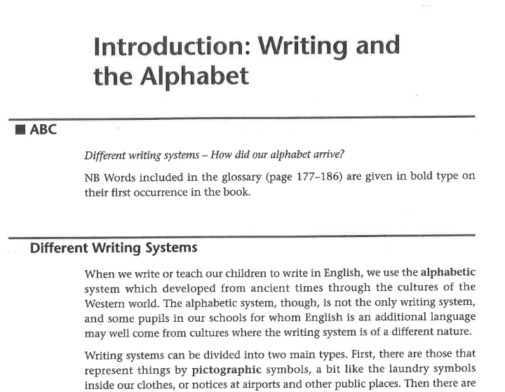

# Module 01 - 8 Aspects of Writing

<!-- TOC -->
* [Module 01 - 8 Aspects of Writing](#module-01---8-aspects-of-writing)
* [General Notes](#general-notes)
* [The 8 Aspects of Writing](#the-8-aspects-of-writing)
  * [Aesthetic](#aesthetic)
  * [Linguistic](#linguistic)
  * [Rhetorical](#rhetorical)
  * [Socio-Cultural](#socio-cultural)
  * [Structural](#structural)
  * [Analytical](#analytical)
  * [Scientific](#scientific)
  * [Technological](#technological)
* [Introduction - Writing and The Alphabet](#introduction---writing-and-the-alphabet)
<!-- TOC -->

# General Notes

The 8 aspects of writing are a composite system to help us understand what
writing is and how its different pieces fit
together, giving us a mental model.

# The 8 Aspects of Writing

1. **Aesthetic**
2. **Linguistic**
3. **Rhetorical**
4. **Socio-Cultural**
5. **Structural**
6. **Analytical**
7. **Scientific**
8. **Technological**

## Aesthetic

- The root meaning connects to the study of beauty or how people find things
  fun, interesting, or beautiful.

## Linguistic

- Deals with language. The study of language and how we communicate.
- People often think of grammar when they think of the linguistic aspect of
  writing, but grammar is much larger than
  just this.
- Grammar is not a set of rules to follow, but a set of practices we utilize
  that can change by context.

## Rhetorical

- How a writer accomplished a purpose, whatever that purpose is. Whether that's
  to entertain, express, or persuade _(or
  any other complex purpose)_.
- Writer's purpose

## Socio-Cultural

- Beliefs, norms, conventions, and values of a culture.
- A writer has to understand the society and cultural context to write into it.
- Often times shown through formatting styles such as:
    - APA
    - IEEE
    - MLA
    - Chicago
    - Etc.
- These are not rules as we need to know the context of the culture that we are
  writing for so that when we use
  something, it is intentional and not just because we do not know the context.
- **Ideological State Apparatuses** _(by Alfu Sirs)_ also known as **ISAs** is a
  neo-marxist concept that is a way of
  analyzing society and its pieces.

## Structural

- How we organize, sequence, and arrange things.
- Deals with how we organize or sequence words based on a particular mindset or
  rhetorical purpose.
- What guides how we structure things.
    - At a paragraph, a chunk, or a full document.
- Even genres have specific structures that audiences will expect.
- Sometimes we opt for Aristotle's "beginning, middle, and end.", but other
  times we will opt for a different structure:
    - Transitional phrases
    - Signaling words
    - Signposting
    - Three-pronged essays
    - Five paragraph essays
    - Etc.

## Analytical

- Critical thinking, logic, logical fallacies.
- How we take apart and analyze things.
- There are many traditional models such as simple mapping models for analyzing:
    - Ven diagrams
    - Root cause analysis
    - Fish-bone diagrams
    - Cause and effect diagrams
    - SWOT analysis
    - Stakeholder analysis
    - Etc.
- Analysis is breaking something down and synthesis is putting something
  together.

## Scientific

- Scientific and technological are often derived from each other, going back and
  forth.
- The scientific aspect of writing is not the Big S scientific.
- Based on the root word of science, **knowledge**.
- The scientific aspect of writing is how we as writers deal with knowledge:
    - How do we discover it?
    - How do we critique it?
    - How do we communicate it?
    - How do we create it?
    - Etc.
- Often has to do with research and how we go about doing research.
- There's a point where the scientific and socio-cultural aspects of writing
  overlap so that there are both moral
  relativism and dissociated big T truth.

## Technological

- Scientific and technological are often derived from each other, going back and
  forth.
- Deals with two main branches of how we want to think about with writing:
    1. How we produce a text
        - Can be physical, digital, cognitive, etc.
            - Microsoft word versus a typewriter versus a brain.
        - The process of production of a text.
        - Other technologies:
            - Manual technologies
            - Mechanical technologies
            - Electronic technologies
            - Digital technologies
            - Linguistic technologies
            - Archival technologies
                - How we store and retrieve writing once it has been produced.
    2. How our brains process things that we read
        - How we read and process information.
        - Technological readability
            - How fast can we read and retain information, etc.
            - How do we design a text so that a reader can take it in fast?
        - There are all kinds of visual design techniques to help cognitive
          upload, such as accessibility.

# Introduction - Writing and The Alphabet

_introduction-writing_systems_and_english_alphabet.pdf)

