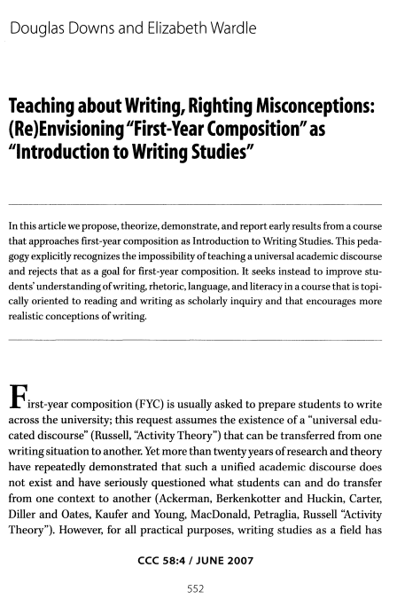

# Module 3 Notes

<!-- TOC -->
* [Module 3 Notes](#module-3-notes)
* [General Notes](#general-notes)
  * [32 Downs and Wardle (2007) Writing - Righting Misconceptions](#32-downs-and-wardle-2007-writing---righting-misconceptions)
* [The Rhetorical Aspect of Writing](#the-rhetorical-aspect-of-writing)
  * [Book Resources](#book-resources)
  * [Notes About Rhetoric](#notes-about-rhetoric)
  * [Rhetoric Key Components](#rhetoric-key-components)
    * [Purpose](#purpose)
<!-- TOC -->

# General Notes

## 32 Downs and Wardle (2007) Writing - Righting Misconceptions

> **PDF Link**: 
> [Here](assets/32-downs_and_wardle_(2007)_writing-righting_misconceptions.pdf)
> 
> 

# The Rhetorical Aspect of Writing

- **Rhetor:** A person being rhetorical
- **Rhetoric:** The art of persuasion
  - _The thing_
- **Rhetorical:** The adjective form of rhetoric
  - _The thing's property, someone can do something rhetorical._

## Book Resources

- _"The Rhetorical Tradition"_ book covers classical times to the present on
    rhetoric.
- _"Ambient Rhetoric"_ book covers the rhetoric of "stuff" and how things and objects can produce messages.
- _"Feminist Rhetorical Practices"_ 

## Notes About Rhetoric

- The <u>_traditional_</u> definition of rhetoric is **the art of discerning the real and apparent means of persuasion**.
  - Because of Aristotle, it is often linked to persuasion.
- The <u>_modern_</u> definition of rhetoric is **the leveraging of discourse or patterns of understanding to accomplish a socially impactful communicative purpose.
  - Meaning that rhetoric is how a writer leverages what they know to accomplish their purpose.
- In pop culture and modern media, there exist two more commonly known links to rhetoric:
  - Political rhetoric
    - This type ties back to Aristotelian rhetoric, born in the Greek agora.
  - Rhetorical questions
- It's important to know the classical Greek rhetorical macrostructures and forms, because in comparison to other forms because knowing that history might change what we view as effective writing, communication, or rhetoric in the Western culture of Europe and the US. 
- Much of western rhetoric is based on Aristotelian rhetoric, which is masculine and aggressive argument, speech, and debate is about winning the debate and proving the other person wrong.
  - Feminist rhetorical practices and Rogerian models are different from this and aim to truly convince someone by walking them through the argument and showing them the truth.

## Rhetoric Key Components

- Purpose
- Exigence
  - _Motivation_
- Topic and Scope
- Stance and Voice
- Visual Design 
  - _Overlaps with aesthetic and technological_
- Genre
- Audience(s)
  - _Links socio-cultural_
- Writing Customs
  - _Links socio-cultural_
- Constraints
  - _Limitations_

### Purpose

- The four commonly acknowledged purposes of writing are:
  - To persuade
  - To entertain
  - To inform
  - To express
- Purpose is often manifold _(layered)_ not singular.
  - Multiple times a writer will have multiple purposes for writing.
- Writers will often need to balance or readjust their purpose based on the
  rhetorical components like audience(s) or genre.
  - Frequently, there will be multiple purposes in writing with their own _dials_ of how much each purpose is included in the writing.
