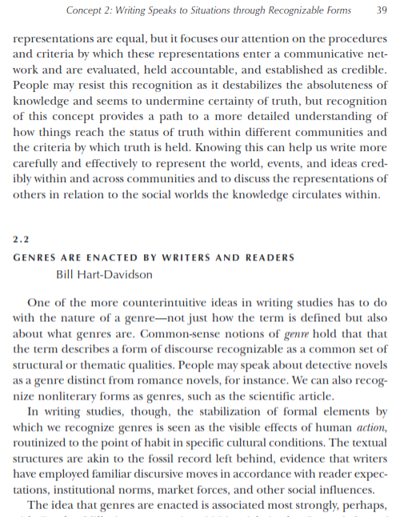
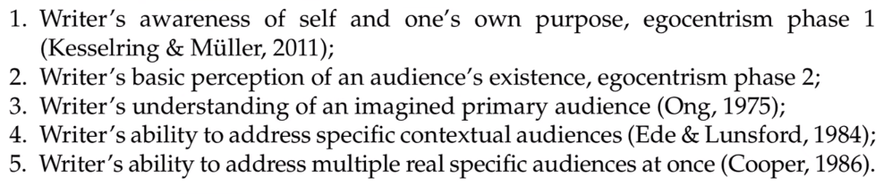

# Module 4

<!-- TOC -->
* [Module 4](#module-4)
* [General Notes](#general-notes)
* [Syntax](#syntax)
  * [Syntax Notes](#syntax-notes)
* [Semantics](#semantics)
* [Pragmatics](#pragmatics)
* [Audience](#audience)
  * [Audience Notes](#audience-notes)
  * [Audience Awareness](#audience-awareness)
    * [The Different Levels of Audience](#the-different-levels-of-audience)
<!-- TOC -->

# General Notes

> **PDF Link:**
> [Here](assets/9-hart-davidson_(2014)_genres_are_enacted_nwwk.pdf)
>
> 

# Syntax

Syntax is about principles of forming and understanding correct sentences.

- The form or structure of a sentence is governed by the rules of syntax, which
  specify word order, sentence organization, and the relationships between
  words, word classes and other sentence elements.

## Syntax Notes

- The syntax or form of a sentence is often governed by a specific pattern.
- English syntax tends to be **SVO** _(Subject-Verb-Object)_.
    - Some languages use reflexive verbs, inverting word order and place a bunch
      of things before _(such as French and Spanish)_.
- How we put words together in ways that make sense.
- Punctuation, spaces, anything that indicates a pause or break in the initial
  phrase are all part of syntax.
- Adjectival order is another part of syntax and something to look at.
- We know that words are organized into structures more than just word order.
    - The children watched \[the firework from the hill ]
    - The children watched \[the firework ] \[from the hill ]
    - The chicken is too hot to eat.

# Semantics

Semantics examines how meaning is encoded in a language.

- Semantics is directly linked to context, examining how meaning is encoded in a
  language, and it is not only concerned with the meanings of words as lexical
  items, but also with levels of language below the word and above it.
- _E.g. meaning of morphemes and sentences._
- The web of language and context and how it affects how speakers interpret
  words.

Key concepts of semantics:

- **Semantic components**
- **Denotation of words**
- **Sense relations** between words such as **antonymy** and **synonymy**
- **Sense relations** between sentences such as **entailment**,
  **presupposition** and others.

When we think of semantics, think about **context** and **the web of words**.

- Semantics has to do with very specific word-choice and how the context
  identifies the language.
- **Denotation:** The literal or primary meaning of a word, in contrast to the
  feelings or ideas that the word suggests.
    - The real and literal meaning of a word.
    - _"beyond their immediate denotation, the words have a connotative power"_
- **Connotation:** an idea or feeling which a word invokes for a person in
  addition to its literal or primary meaning.
    - Connected to the altered or webs of meanings
    - _"the word “discipline” has unhappy connotations of punishment and
      repression"_

# Pragmatics

Pragmatics is the study of meaning in context.

It deals with particular utterances in particular situations and is especially
concerned with the various ways in which many social contexts of language
performance can influence interpretation.

- In other words, pragmatics are concerned with the way language is used to
  communicate rather than with the way language is internally structured.
- Think more about the practical use of language in a particular context.
- When hearing something like _"You don't know who you is"_ in a place where it
  is often used and is a normal part of the language, it is not incorrect to say
  depending on the context.
    - Saying something in a certain way is not wrong unless enough people
      believe it is wrong.
    - _"You"_ can be given different context based on how you use it and when.

# Audience

- **Primary Audience(s)**
    - The intended and known person or groups of people being written to
    - Sometimes described as _TARGET_ audience
- **Secondary Audience(s)**
    - Known, potential audiences but not necessarily targeted
- **Collateral Audience(s)**
    - Unintended/un-targeted, and often unknown, audiences that read the text

## Audience Notes

- Audience is often taught as a broad thing, but we should have multiple layers
  of audience.
    - There is the main audience, but there should be a secondary audience and a
      collateral audience.
    - The more you think about the different layers of audience, the more
      effective you'll be as a writer.
- Always be aware of the potential for collateral audiences and how they might
  interpret and respond to your writing.
    - **Stakeholder analysis** is useful for identifying potential collateral
      audiences.
- Another example is social media, when people you may not want seeing your
  profile see it.

## Audience Awareness

- Can help determine a writer's maturity level
    - Example: Little kid wants a cookie...
        - **Immature:** _"I want a cookie!"_
        - **Mature:** _"Mom, can I have a cookie?"_

### The Different Levels of Audience

There is a shift from imagined audience to real audience to where
you're actually writing to the people that you understand multiple things about.

- Going from level 3 audience to level 4

The most mature writer is number 5.
