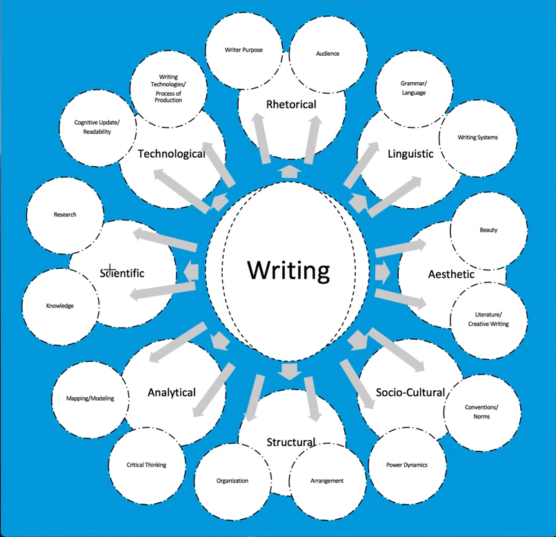

# Module 5 Notes

# General Notes

## PDF Readings

- [Martinez (2016) language identity US-Mexico Borderlands](assets/13-martinez_(2016)_language_identity_us-mexico_borderlands.pdf)
- [Tan (1990) Mother Tongue](assets/16-tan_(1990)_mother_tongue.pdf)
- [Norton FG to Writing 4th Edition (2016)](assets/36-norton_fg_to_writing-4th_ed_(2016)_sections_1_and_2.pdf)

# Exigence

- The meaning of **exigence/exigency** is from the Latin noun _exigentia_, which means "urgency" and comes from the verb _exigere_, meaning "to demand or require."
  - An emergency situation, or exigency, is urgent and demands immediate action.
  - Basically defined as "Why I write right now."
  - A writer's motivation for writing
- This is also often linked to the rhetorically principle of **Kairos** _(the timely moment)_
  - Finding the most appropriate time to respond to the trigger **exigence**.
    - _I.e. nailing the punchline of a joke_
    - _I.e. There is an appropriate time socially to make a joke and that time may pass in only moments_
  - People know of ethos, pathos, logos, but not kairos

## Exigency Notes

- **Purpose** is having something you believe and want to write about
- **Exigency** is having something that triggered you to do it <u>now</u>.
  - Why is right now the right time to discuss this thing, with this audience, in this time and place?
  - Exigence is something that feels like it needs a response
- **Exigency** is the trigger to get you moving and **kairos** is the timeframe that is the appropriate time to respond to the trigger.

# Genre

- _(links to all 8 aspects of writing in some way, but is more often hyper-associated with aesthetic (fictional/literary) genres_
- Any type/form of communication with socially agreed
upon norms or conventions
- Different genres have preferred purposes or primary
values for communicating
  - FB post is more personal.
  - Tweets tend to be informational or sassy.
  - Academic essays often emphasize logic-based or fact-based persuasion rather than personal experience
- Writers should choose the genre of writing or adjust to the genre of writing carefully to be sure to leverage the genre effectively for target audience(s)

## Genre Notes

- Genres have parameters around them set by a group of people that alter how you write in that genre
- Figure out what your **purpose** looks like when communicated in a particular **genre**.
- Genres can use all eight aspects of writing: 
  
- **Active voice** is privileged _(made more important)_ in humanities
- **Passive voice** is privileged _(made more important)_ in sciences
  - Especially in the lab reports and methods sections
- The form, structure, or order that we put things in is most connected to **genre**.
- Thesis goes at the bottom of the intro in the paragraph in Western culture _(in other cultures it may go at the top)_