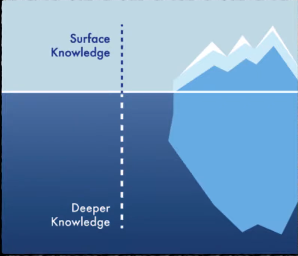
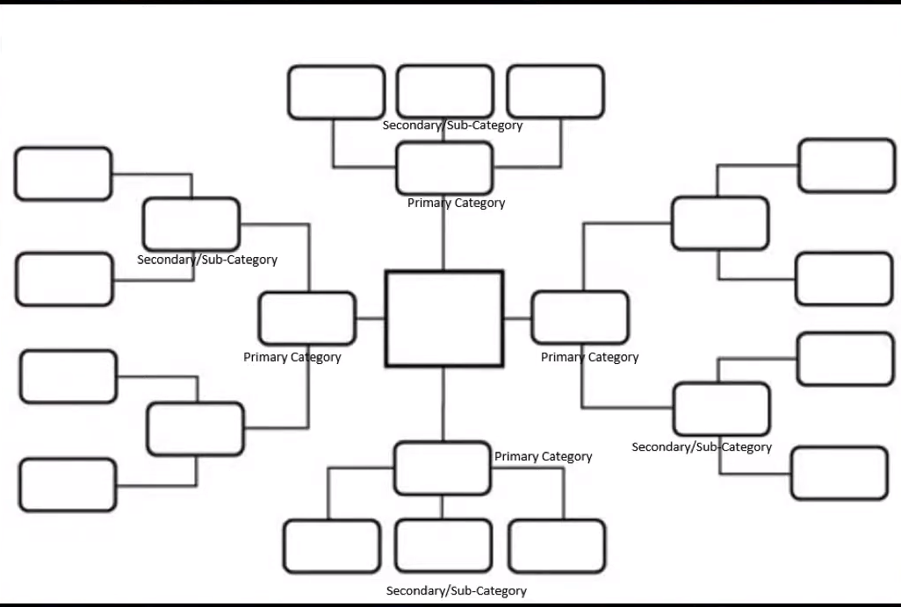
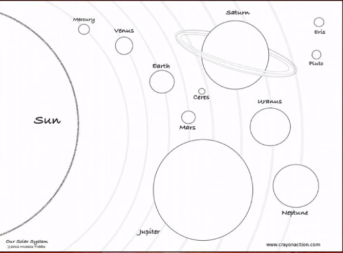
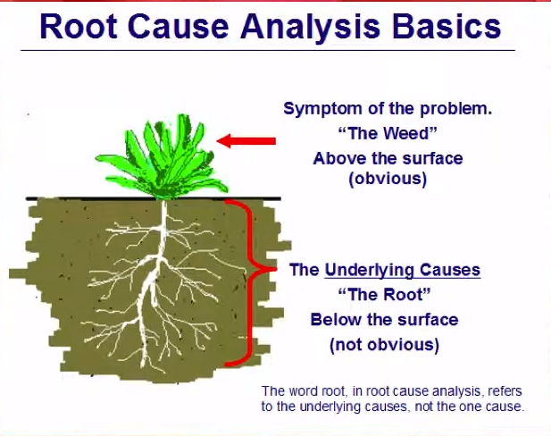
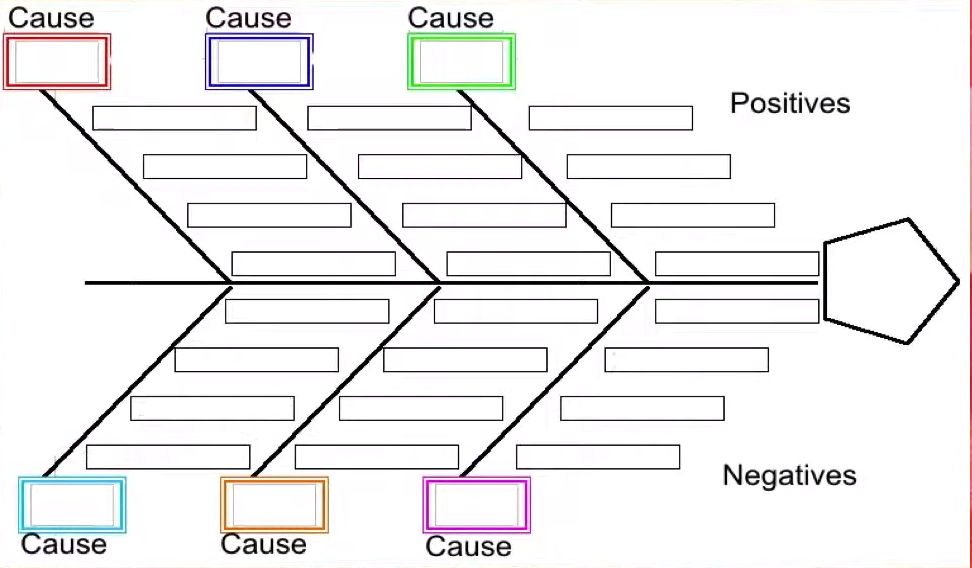
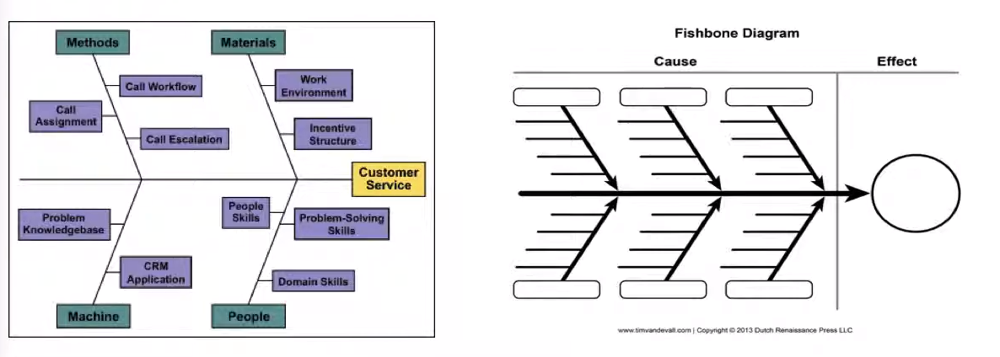
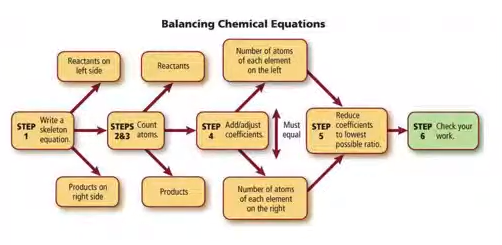
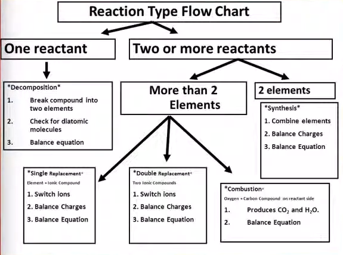
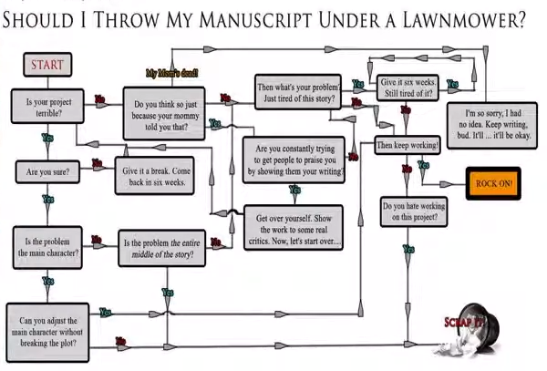

# Module 6 - Analytical Writing

<!-- TOC -->
* [Module 6 - Analytical Writing](#module-6---analytical-writing)
* [General Notes](#general-notes)
  * [Additional Resources](#additional-resources)
* [Analytical Writing](#analytical-writing)
* [Deconstructing](#deconstructing)
* [Overview of Key Components](#overview-of-key-components)
  * [Iceberg Theory](#iceberg-theory)
* [Common Types of Analysis](#common-types-of-analysis)
  * [Stakeholder Mapping/Analysis](#stakeholder-mappinganalysis)
    * [Systems of Stakeholders](#systems-of-stakeholders)
    * [Stakeholder Mapping](#stakeholder-mapping)
    * [Stakeholder Mapping - Power Dynamics](#stakeholder-mapping---power-dynamics)
  * [Root Cause Analysis](#root-cause-analysis)
  * [Basic Fishbone Diagram](#basic-fishbone-diagram)
    * [Advanced Fishbone Diagram](#advanced-fishbone-diagram)
  * [Process Mapping / Developing Algorithms](#process-mapping--developing-algorithms)
    * [Genres of Process Mapping](#genres-of-process-mapping)
      * [Example One](#example-one)
      * [Example Two](#example-two)
      * [Example Three](#example-three)
* [Levels of Cognition](#levels-of-cognition)
<!-- TOC -->

# General Notes

## Additional Resources

- **PDF:**
  [How Experts Differ From Novices](assets/12-nap_(2000)_how_people_learn_ch5-how_experts_differ_from_novices_(available_online).pdf)

# Analytical Writing

Analysis is Pulling something apart to better understand:

1. The pieces
2. The quality/nature/attributes of those pieces
3. Their relationships to each
4. Their role as part of the larger whole, composite, or system.

# Deconstructing

Ways to imagine analysis:

- Chilton's Manual
- Exploded Engineering Diagram

# Overview of Key Components

- Logic and Logical Fallacies
- Critical thinking / deeper thinking
    - Activity systems
    - Writing ecologies
    - Actor-network theory
    - _These models overlap with socio-cultural aspect_
- Iceberg theory
- Levels of cognition
    - _These also overlap with some rhetorical genres of sentences_
- Common methods of analysis and analytical mapping
    - Stakeholder mapping/analysis
    - Root cause analysis
    - SWOT analysis
    - Fishbone diagramming
    - Process algorithms
- **Logical Fallacies Deeper:**
  [Google Doc](https://drive.google.com/file/d/1E34POCKhoi-xqZ3cAAUOkllLpIh0cRKf/view?usp%20=sharing)
  | [Local Doc](assets/logical_fallacies_overview-micro-macro.docx)

## Iceberg Theory

- You have to infer that there is deeper knowledge than the surface level
- The audience complicates what counts as _below the surface_.
    - College students will often include information that they have researched
      and consider _deeper knowledge_, but that information is not new or below
      surface to their audience.
    - The audience may feel that you're talking about surface level and obvious
      information.
    - The key is to narrow down to something specific and use those to connect
      to the larger principles. The audience may not be experts in that specific
      thing.

**Above Surface**

- What you can:
    - See
    - Observe
    - Report

**Below Surface**

- What you can't see
- Analysis is inferring or interpreting the qualities of what you can't see
  based on what is visible or observable.

# Common Types of Analysis

- Stakeholder mapping/analysis
    - WHO impacts
- Ideological apparati
- Root cause(s) analysis
- Fishbone diagramming
- Process algorithms
- SWOT analysis

## Stakeholder Mapping/Analysis

- **Stakeholder**
    - A _person_ or _group of people_ who has an interest in or investment in
      something.
        - This investment may be emotional, social, physical, monetary,
          intellectual, etc.

### Systems of Stakeholders

- Althusser’s Ideological Apparatuses (more on these
  when we discuss the Socio-Cultural Aspect of Writing)
    - The educational
    - The family apparatus
    - The legal/governmental
    - The political (parties, lobbies, trade-unions, etc)
    - The religious
    - The journalistic media (press, radio, television, etc)
    - The cultural (Literature, Arts, Sports, etc)
- These can be your **starting points** as you think about
  stakeholders in your particular text, topic, or issue
    - What people are impacted, impacting or care about the thing?
- There may be more context-specific people affect-ed/-ing

### Stakeholder Mapping

- What makes this different than normal mind-mapping is that you are focusing on
  people and groups of people

### Stakeholder Mapping - Power Dynamics

**Hegemony** is the power dynamics between stakeholders and is important to
consider when mapping stakeholders because the previous version did not include
the level of pull that each stakeholder has.

- This is more accurate in showing the pull that each stakeholder has.

## Root Cause Analysis

- Helps us determine, in a more organic way, why a problem/need/issue exists.
- Gives a clearer idea of the system behind what we see.
- _Sometimes uses basic Fishbone diagrams_

## Basic Fishbone Diagram

- May include people, but is often more often associated with the _what_ and
  _why_ something happens, the objects and procedures that play into a system,
  situation, or problem.
- Root cause analysis is more general, but fishbone diagrams are more specific.

### Advanced Fishbone Diagram

- _Further reading: <https://www.moresteam.com/toolbox/fishbone-diagram.cfm>_

The six categories:

- Machine
- Method
- Materials
- Measurement
- People
- Environment

It is also possible to create and substitute your own categories such as:

- ~~Machine~~ &rarr; Policies
- ~~Method~~ &rarr; Procedures
- Materials
- Measurement
- People
- Environment

Assume that they want you to use the default six categories if they do not tell
you that you can use your own.

## Process Mapping / Developing Algorithms

**Definition:** Developing "a process or set of rules to be followed in
calculations or other problem-solving operations, especially by a computer."

- An algorithm is basically a decision-making process that people or computers
  use consistently to accomplish a goal. When people repeat the same general
  process, we call that a routine.
    - _i.e. getting ready in the morning, meal planning for a week, signing up
      for classes_
- **Heuristic &rarr; Algorithm &rarr; Specific Code for execution (Essay
  Outline)**
    - **Heuristic Definition:** Proceeding to a solution by trial and error or
      by rules that are only loosely defined.
    - Messy flexible process
    - Specific sequence of steps
    - Steps applied/executed in a particular situation

### Genres of Process Mapping

An algorithm is it’s own genre, but it also has a genre family of sorts

- Flow Charts
- Schemas
- The Methods section in an IMRD formatted essay is meant to be an algorithm
- Sometimes an outline can be a form of process mapping, but there are reasons
  why it does not always count.
    - For instance, Outlines only map the structure of a single text

#### Example One

#### Example Two

#### Example Three

# Levels of Cognition

- Have to do with the levels of brain-work involved with each level.

_Overlaps with rhetorical genres of sentences_

- Reporting
    - It takes less effort to list facts. Start with what you know.
    - This is the start of analysis and is getting the facts about something. It
      is not breaking any of them down, just listing them.
    - Research papers are finding and stating facts, but not analyzing them.
      Analysis requires you to use those sources and facts to do something with
      them.
- Analysis of Synthesis
    - These are inverse processes of each other
    - Analysis also uses inferences based on things that you can see.
- **Evaluation:** A value judgement about something based on criteria
    - Effective evaluation is based on specific, tangible, measurable criteria
    - Sometimes **qualitative** data is data that people don't want to take the
      time to find **quantitative** data for.
        - **Qualitative** data is data that is not measurable and is usually
          perception-based.
            - _"How many people think this thing is true?"_
    - **Criteria:** Specific, tangible, measurable qualities
        - Most effective when we go beyond simple **YES/NO**
        - I.e. **not <u>either/or</u>** but **<u>to what degree</u>**
- Advocacy
    - Advocating for the thing you've come to believe based on the found data.
