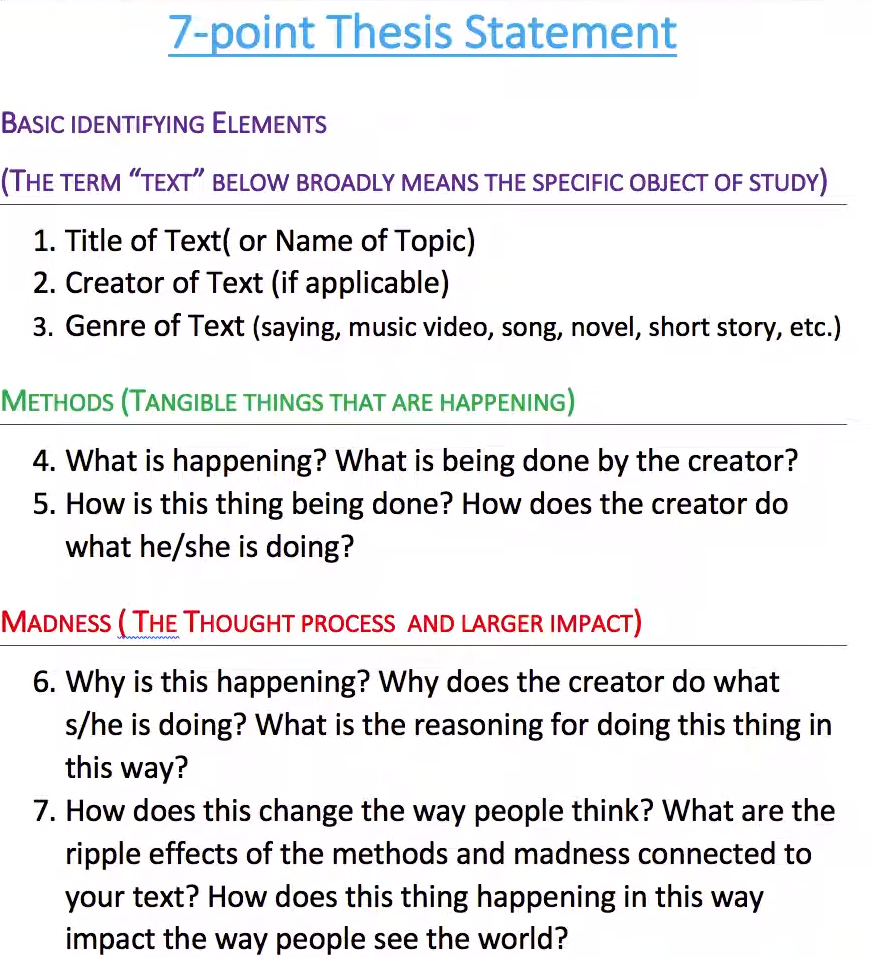

# Module 7

Compared it to making a new friend with the thesis statement being stating your relational purpose.

- What you want to do with that person

# General Notes

- Essay comes from a french word meaning "to try" or "to attempt at something"
  - The first few drafts of an essay should be seen as an attempt at understanding or working through something.
- **IMRD** is a common structure for essays
  - Introduction
    - Establishes a relationship with the reader
  - Methods
  - Results
  - Discussion
- If you have not been given a genre and do not have a model to use, you can use this one _(although it is limited in its scope)_.
  - Anything longer than 3 paragraphs and it no longer works.
  - Main pieces of an introduction:
    - The hook
    - The moment you provide meaningful background information
    - The thesis statement _(or guiding statement)_
      - Usually ends at the end of the first paragraph of the beginning of the second paragraph. The longer the essay, the further that might extend.
- Thesis statements are to the point and straight forward but can also be complex.
- Body paragraphs are the equivalent of meaningful experiences with our readers.
  - And each one contains a different meaningful experience.
  - The cycle continues of meaninful experiences until something happens that causes a big enough shift that requires the current one to be closed out.
  - The order matters as well
  - Some models for paragraphing:
    - Pie model
    - Axes model
    - C six model
    - Combining Pie with the S from axes
- One way to do the conclusion is to treat it like a _"goodbye"_ letter.
  - You can also think of it as a major transition that closes out the season or topic of the essay.
- With the conclusion, you will re-establish the purpose of the essay, restating the thesis and re-establishing the meaninful experiences
  - You need something to say that you are done in your conclusion and the best way to do that is often _"next steps"_ that turn the reader away from the thesis and towards the future.
- Just to sum up the conclusion requirements:
  - Restate the purpose in the beginning _(thesis statement)_
  - Re-establish the meaningful experiences
  - A concluding mark
  - A transition to the future such as next steps
    - _The conclusion is often reversed from the introduction_
- Writing is about meaningful experiences with other people through words.

# 7-Point Thesis Statement

## Overall Steps

1. Title of Text
   - _(or Name of Topic)_
2. Creator of Text
   - _(if applicable)_
3. Genre of Text
   - _(saying, music, video, song, novel, short story, etc.)_
4. What is happening? What is being done by the creator?
5. How is this thing being done? How does the creator do what he/she is doing?
6. Why is this happening? Why does the creator do what s/he is doing? What is the reasoning for doing this thing in this way?
7. How does this change the way people think? What are the ripple effects of the methods and madness connect to your text? How does this thing happening in this way impact the way people see the world? 

## Basic Identifying Elements

_Text_ below broadly means the specific object of study.

1. Title of Text
   - _(or Name of Topic)_
2. Creator of Text
   - _(if applicable)_
3. Genre of Text
   - _(saying, music, video, song, novel, short story, etc.)_

## Methods

Tangible Things That are Happening

4. What is happening? What is being done by the creator?
5. How is this thing being done? How does the creator do what he/she is doing?

## Madness 

The thought process and larger impact

6. Why is this happening? Why does the creator do what s/he is doing? What is the reasoning for doing this thing in this way?
7. How does this change the way people think? What are the ripple effects of the methods and madness connect to your text? How does this thing happening in this way impact the way people see the world?

## Thesis Notes

- The thesis should make a claim and not just inform, establishing your purpose for writing that paper.
- Thesis statements perform several functions:
  - _Rhetorical_
    - Part of establishing the purpose for the writing.
  - _Structural_
    - In 3-prong thesis essays, the thesis statement performs signposting functions indicating the main points of the essay.
  - _Analytical_ 
- The thesis statement actually hits on 5 of the 8 aspects of writing and is why it is so important.
- Essays should be standalone text that when taken out of the classroom would be able to read as professional if published somewhere.
  - Don't just think about them as responses to prompts.
- These 7 points should be used to bring together the main thoughts of the essay, often best in complex compound sentences.
- Having a deep thesis statement holds you accountable to push deep into the argument rather than broad-stroke arguments.
  - There's a benefit to pushing deep early on by setting these expectations for both the readers and yourself.
- It can be good to do the thesis statement in a complex compound sentence, but in some cultures it is also acceptable to split up the thesis statement.