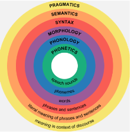

# Module 9 - Writing Organization

<!-- TOC -->
* [Module 9 - Writing Organization](#module-9---writing-organization)
* [General Notes](#general-notes)
  * [16 Organization Strategies](#16-organization-strategies)
    * [Overview](#overview)
    * [Strategies](#strategies)
    * [Conclusion](#conclusion)
  * [8 Aspects of Writing Rubric with Descriptions](#8-aspects-of-writing-rubric-with-descriptions)
    * [Rhetorical Aspect](#rhetorical-aspect)
    * [Structural (Argumentation) Aspect](#structural-argumentation-aspect)
    * [Linguistic Aspect](#linguistic-aspect)
    * [Technological Aspect](#technological-aspect)
    * [Analytical Aspect](#analytical-aspect)
    * [Socio-Cultural Aspect](#socio-cultural-aspect)
    * [Aesthetic Aspect](#aesthetic-aspect)
    * [Scientific (Research) Aspect](#scientific-research-aspect)
  * [11 Common Commas](#11-common-commas)
    * [Common Comma Usage](#common-comma-usage)
    * [Key Takeaways](#key-takeaways)
  * [20 Most Common Formal Errors](#20-most-common-formal-errors)
    * [Common Errors with Examples and Corrections](#common-errors-with-examples-and-corrections)
    * [How to Reduce Errors in Your Writing](#how-to-reduce-errors-in-your-writing)
    * [Identifying Errors to Focus On](#identifying-errors-to-focus-on)
<!-- TOC -->

# General Notes

## 16 Organization Strategies

> [16 organization strategies - PDF Link](assets/16-organization-strategies.pdf)

### Overview

- Organization strategies help in structuring the ideas and points in an essay.
- The choice of strategy depends on the purpose of the essay.
- These strategies are tools to communicate ideas clearly and are not goals in
  themselves.

### Strategies

1. **Time Order (Chronological Order)**
    - Useful for narrating personal events, historical events, explaining
      processes, or tracing complex causes and effects.
    - **_Example:_** _"First, my wife hit me. Then, she stabbed me. I called 911
      for help. Finally, we made arrangements for marital counseling."_
2. **Spatial Order**
    - Useful for describing a scene, a room, a person, or a technical layout. It
      can also explain how parts of a machine fit together or how a team
      operates.
    - **_Example:_** _Description of how dirty farm labor can be, from shoes to
      hair._
3. **General to Specific**
    - Begins by discussing a general trend or problem, and gradually narrows the
      focus.
    - **_Example:_** _Discussion of romantic triangles as a plot device in
      British literature, narrowing down to a specific book and part of the
      book._
4. **Comparison / Contrast**
    - Systematically goes through point-by-point comparison, contrast, or both.
    - **_Example:_** _Comparison and contrast between Lady Jane Grey and Queen
      Elizabeth I._
5. **Abstract to Concrete**
    - Compares a difficult or abstract concept to a common, everyday phenomenon.
    - **_Example:_** _Comparison of the theory of quantum mechanics to a card
      game._
6. **Importance**
    - Moves from the least important point or item toward items of increasing
      importance.
    - **_Example:_** _If a room caught fire, the order of items to save based on
      their importance._
7. **Magician's Trick**
    - A variant of "Importance", where the second-best point is first, the best
      point is last, and everything else is in the middle.
    - Useful for having a strong introduction and a memorable conclusion.

### Conclusion

- These strategies can be experimented with and should not restrict the writing
  process.
- The goal is to communicate an idea in a clear, intelligible manner.

## 8 Aspects of Writing Rubric with Descriptions

> [8 aspects of writing rubric with descriptions - PDF Link](assets/0-8_aspects_rubric_with_descriptions.docx)

### Rhetorical Aspect

- Focuses on:
    - *Topic*
    - *Audience*
    - *Purpose*
    - *Constraints*
    - *Genre*
    - *Visual Design*
    - *Exigence*
    - *Writing Culture*
- Grading based on depth and support of **thesis statement** and **claims** for
  target audience
- Points deducted for overly simple arguments or reductive language (e.g.,
  always, never, no one)

### Structural (Argumentation) Aspect

- Focuses on **structural connections** of the essay
- Points awarded for:
    - Effective signposting/transitions
    - Structuring of introduction, conclusion, and body paragraphs
- Importance of adhering to genre conventions and rhetorical purpose

### Linguistic Aspect

- Covers language use:
    - *Morphology*
    - *Syntax*
    - *Punctuation*
    - *Semantics*
    - *Pragmatics*
- Grading based on socio-cultural expectations of academic **Standard American
  English (SAE)/Standard Written English (SWE)**
- Focus on word error, sentence structure, punctuation convention concerns

### Technological Aspect

- Focuses on use of context-appropriate tools and technologies
- Grading based on conventions used for the expected technology of the genre
- Involves formatting of the page and use of word processing tools

### Analytical Aspect

- Looks at **depth of thinking** in the essay
- Writing should answer questions of:
    - *Why*
    - *How*
    - *Who is impacted*
- Importance of substantial commentary that builds on established knowledge

### Socio-Cultural Aspect

- Grading based on consideration of the unique primary audience and potential
  collateral audiences
- Adherence to academic norms (e.g., avoiding "you/your," “I think/I feel,”
  contractions)

### Aesthetic Aspect

- Concerns beauty or effective audience engagement
- Points awarded for use of:
    - Varied, specific, and vivid language
    - Visual design elements
- Points deducted for vague pronouns, less concrete descriptions, or
  repetitiveness

### Scientific (Research) Aspect

- Focuses on research and displaying knowledge of the subject
- Points awarded for use of appropriate, credible, academic sources with
  integrity
- Importance of style-specific **Works Cited/References** page, in-text
  citations, and effective integration of data

## 11 Common Commas

> [11 common commas - PDF Link](assets/11-common_commas.pdf)

### Common Comma Usage

1. **Introductory Clauses**
    - _**Rule:**_
        - Use a comma to offset any grouping of 3+ words coming before the
          grammatical subject of a sentence.
        - Exception: Less than 3 words is recommended but not required.
    - **_Structure:_** `Intro, (S)ubject (V)erb`.
    - **_Example:_** "After looking under the couch, I hopelessly sat down."
2. **Coordinating Conjunctions (F.A.N.B.O.Y.S.)**
    - **_Rule:_**
        - A comma is necessary when a sentence contains two independent
          clauses (Subject-Verb) which are connected by one of these joining
          words (For, And, Nor, But, Or, Yet, So)
    - **_Structure:_** `(S1)ubject (V1)erb, (CC) (S2)ubject (V2)erb`.
    - **_Example:_** "The journal article opened my eyes, but now I needed
      sunglasses."
3. **Parenthetical / Non-Essential Phrases / Interjections**
    - **_Rule:_**
        - Use commas to offset extra information/insertions that are not
          necessary but may be helpful for your reader.
    - **_Possible Structures:_**
        - `S, P, V`
        - `Intro, S V, P`
        - `S1 V1 , P, CC S2 , P,V2, P`
    - **_Example:_** "My mom, the lawyer, baked cookies."
4. **Lists of Items**
    - **_List Rule 1:_**
        - Use commas to separate a (3+) series of equivalent/parallel items,
          actions, or dependent phrases.
    - **_Possible Structures:_**
        - `S V L1, L2, L3, and L4`
        - `S=(L1, L2, and L3 ) V`
    - _**Example:**_ "One’s writing should be concise, specific, interesting,
      and
      engaging."
    - **_List Rule 2:_**
        - Use commas to separate equal adjectives(A) that describe the same
          noun(N).
    - **_Possible Structures:_**
        - `(A1, A2) S V`
        - `S V (A1, A2) N`
    - _**Example**:_ "The sleek, red car sped by."

### Key Takeaways

- Comma usage is critical in English writing for clarity and meaning.
- The four common uses of commas include introductory clauses, coordinating
  conjunctions, parenthetical phrases, and lists of items.
- Understanding and applying these rules can significantly improve the
  readability and effectiveness of your writing.

## 20 Most Common Formal Errors

> [20 most common formal errors - PDF Link](assets/handout_18-20_most_common_formal_errors.pdf)

### Common Errors with Examples and Corrections

1. <u>**Wrong word**:</u>
    1. _**Incorrect:**_ _"Please except my apology."_
    2. _**Correct:**_ _"Please accept my apology."_
2. <u>**Spelling**:</u>
    1. _**Incorrect:**_ _"We were happy to recieve your job position
       announcement."_
    2. _**Correct:**_ _"We were happy to receive your job position
       announcement."_
3. <u>**Incomplete or missing documentation**:</u>
    1. _**Incorrect:**_ _"Your ear for language is more reliable than your
       eye."_
    2. _**Correct:**_ _"Your ear for language is more reliable than your eye"_ (
       Hortshoj 85).
4. <u>**Mechanical error with quotation**:</u>
    1. _**Incorrect:**_ _"Writing is a struggle against silence Carlos Fuentes
       asserts."_
    2. _**Correct:**_ _"Writing is a struggle against silence,"_ Carlos Fuentes
       asserts.
5. <u>**Missing comma after an introductory element**:</u>
    1. _**Incorrect:**_ _"While I typed my brother used headphones to listen to
       music."_
    2. _**Correct:**_ _"While I typed, my brother used headphones to listen to
       music."_
6. <u>**Missing word**:</u>
    1. _**Incorrect:**_ _"The writing process more complicated than most people
       think."_
    2. _**Correct:**_ _"The writing process is more complicated than most people
       think."_
7. <u>**Unnecessary or missing capitalization**:</u>
    1. _**Incorrect:**_ _"Even expert writers need a book like A writer’s
       resource."_
    2. _**Correct:**_ _"Even expert writers need a book like A Writer’s
       Resource."_
8. <u>**Vague pronoun reference**:</u>
    1. _**Incorrect:**_ _"Some students think their first draft is their last
       draft, which can cause frustration."_
    2. _**Correct:**_ _"Some students think their first draft is their last
       draft, a belief that can cause frustration."_
9. <u>**Unnecessary or missing apostrophe (including its/it’s)**:</u>
    1. _**Incorrect:**_ _"Kershaws pitching got better as the season went on."_
    2. _**Correct:**_ _"Kershaw’s pitching got better as the season went on."_
10. <u>**Unnecessary comma**:</u>
    1. _**Incorrect:**_ _"Research has found, that procrastination is not an
       effective time-management strategy."_
    2. _**Correct:**_ _"Research has found that procrastination is not an
       effective time-management strategy."_
11. <u>**Unnecessary shift in verb tense**:</u>
    1. _**Incorrect:**_ _"We learn things better when we struggled to learn
       them."_
    2. _**Correct:**_ _"We learn things better when we struggle to learn them."_
12. <u>**Missing comma in a compound sentence**:</u>
    1. _**Incorrect:**_ "You start out writing crap and
        thinking it's good stuff and then gradually you get better at it." –Octavia
        Butler
    2. _**Correct:**_ _"You start out writing crap and thinking it's good stuff,
       and then gradually you get better at it."_ –Octavia Butler
13. <u>**Faulty sentence structure**:</u>
    1. _**Incorrect:**_ _"It was hard for me to get started even though I’m glad
       I doing it."_
    2. _**Correct:**_ _"Even though it was hard for me to get started, I’m glad
       I did."_
14. <u>**Comma splice**:</u>
    1. _**Incorrect:**_ _"Many students have a hard time when they start
       college, it becomes easier for them later."_
    2. _**Correct:**_ _"Many students have a hard time when they start college,
       and it becomes easier for them later."_
15. <u>**Lack of pronoun-antecedent agreement**:</u>
    1. _**Incorrect:**_ _"A resilient person knows how to take care of
       themselves."_
    2. _**Correct:**_ _"Resilient people know how to take care of themselves."_
16. <u>**Missing comma(s) with a non-essential element**:</u>
    1. _**Incorrect:**_ _"Bird by Bird a book by Anne Lamott is an excellent
       source of encouragement for writers."_
    2. _**Correct:**_ _"Bird by Bird, a book by Anne Lamott, is an excellent
       source of encouragement for writers."_
17. <u>**Sentence fragment**:</u>
    1. _**Incorrect:**_ _"I would rather be somewhere quiet. If I need to be
       able to think."_
    2. _**Correct:**_ _"I would rather be somewhere quiet if I need to be able
       to think."_
18. <u>**Run-on sentence**:</u>
    1. _**Incorrect:**_ _"Most mistakes in English cannot be committed in speech
       they can only be made in writing."_
    2. _**Correct:**_ _"Most mistakes in English cannot be committed in speech;
       they can only be made in writing."_
19. <u>**Poorly integrated quotation**:</u>
    1. _**Incorrect:**_ _"Writing comes more easily if you have something to
       say" (Asch)._
    2. _**Correct:**_ _Sholem Asch might also support the practice of
       prewriting. According to Asch, "Writing comes more easily if you have
       something to say."_
20. <u>**Unnecessary or missing hyphen**:</u>
    1. _**Incorrect:**_ _"This is a newly-discovered place."_
    2. _**Correct:**_ _"This is a newly discovered place."_

### How to Reduce Errors in Your Writing

1. **Write first and edit later**: The less you think about grammar while you
   are writing, the more fluent your writing will be and the fewer mistakes you
   will make.
2. **Give yourself time**: You will notice much more if you wait, after you are
   done drafting, before you go back to edit.
3. **Print your paper out**: It makes it easier to see typos and other errors
   than when you look at your work on a screen.
4. **Read your writing out loud**: Your ear can often hear more than your eye
   can see.
5. **Read your work backwards**: Start with the last sentence, then read the
   next-to-last sentence, and so on.
6. **Find someone who will help you look over your writing**: Because you are so
   close to your own writing, a reader will always be able to see things that
   you cannot.
7. **Read more. Read well-written prose**: We learn language best through
   immersion.
8. **Focus on one error at a time**: If you know you have trouble with commas,
   once you know that the rest of your paper is revised the way you want it, go
   through your paper and just focus on that.

### Identifying Errors to Focus On

- What errors have instructors pointed out in your work in the past?
- Has your instructor mentioned any errors that particularly bother them?
- What errors do you worry about the most?
