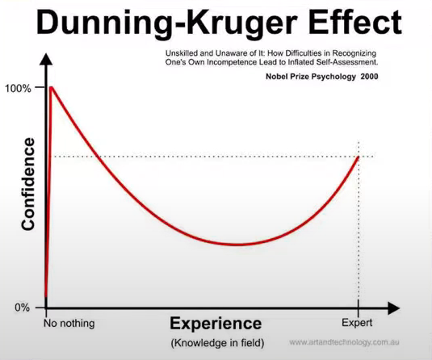

# Module 11

# General Notes

## Memory: Crash Course Study Skills

- **Video Link:** [Link](https://www.youtube.com/watch?v=SZbdK9e9bxs)

We remember by putting memory through multiple stages:

1. Sensory memory
   - Processes everything your senses detect or experience in the real world.
   - Short-term memory and most info is lost almost immediately
     - What does stick is transferred to short-term memory or working memory
2. Short term memory _(working memory)_
   - Similar to RAM
   - Working memory can only handle 4 - 7 bits (items) at one time.
     - This can be modified by chunking information: _FBIKGBCIA &rarr; FBI KGB CIA_
3. Memory heads to hippocampus and is augmented with neurotransmitters.
   - Transmit metadata _(information about the information)_
4. New synapses are formed in the brain
   - The connection between neurons
   - The neurons don't actually touch and have a small gap that allows more neurotransmitters to move information between them.

You have to space your learning out or new learning will overwrite old learning.

- The brain latches onto things that are tangible, visual, and uncommon than it does with the abstract or the mundane.
- There is storage strength and retrieval strength.
  - Storage strength is how well you remember something.
  - Retrieval strength is how easily you can recall something.
    - The longer you wait to retrieve memories, the harder it becomes.
- The principle of desirable difficulty
  - You want to find the point right before you're about to forget something.
  - This can be done with spaced repetition by increasing the amount of time in between each study session for any piece of information.

# Recognition and Recall Memory - The Scientific Aspect of Writing

There are two types of memory:

- **Recognition memory**
  - When input triggers a memory
    - Like when something is on the tip of your tongue.
- **Recall memory**
  - When you have to recall a memory without any input
  - When you have the information fully learned and ready for recall
  - **Preferred memory**

It can be argued that the ability to find information is more important than the ability to memorize information.

## Making Knowledge Stick

- Our brains have to see knowledge as important for it to be stored in our long-term memory.

### Challenges to Retaining Knowledge: Dunning-Kruger Effect

- If someone knows a small amount, they feel like they know a lot.
- When we are in the **DKE**, we are less likely to think we need to learn something, assuming we know it well enough.
- The point when it starts to dip is when we realize how much we don't know.
  - The more you understand about something, the less confident you feel that you can do it.
  - The bottom of the curve is the _imposter syndrome_.

# Ethnography

> **PDF Resource:** [Robinson Caskie (2006) Ethnography](assets/6-robinson-caskie_(2006)_ethnography_(2-page_introduction).pdf) 

- Ethnography is the study of culture and writing about culture.
- They include "thick descriptions" that are adding soft analysis and interpretation to allow someone to understand at a later time the what and how the context changed the meaning of the artifact.
  - _They said this and winked_ to allow for deeper analysis and interpretation.
  - Analytical free-write.

## Fieldnotes

- Thick descriptions go in field notes
- Pictures go in field notes
- Additional data goes in field notes
- Key research terms go in field notes
- Descriptions of what you see around you go in field notes
- Placeholders for knowledge where you dump what you see so you can use it later.

## Emic vs Etic

> _In anthropology, folkloristics, and the social and behavioral sciences, emic and etic refer to two kinds of field research done and viewpoints obtained: emic, from within the social group (from the perspective of the subject) and etic, from outside (from the perspective of the observer)._

- Emic
  - The perspective of the subject
  - The insider's perspective
  - When you are already a participant of that culture
- Etic
  - The perspective of the observer
  - The outsider's perspective
  - _I.e., studying a culture that you are not a part of_

# The Socio-Cultural Aspect of Writing

## Key Socio-Cultural Components

_The first three are specificad dlly related to writing._

> - **Conventions**
> - **Norms**
> - **Beliefs** 
> 
> _Notes:_
> 
> - Shared beliefs within a culture eventually become norms.
> - Beliefs start individual, then become shared beliefs &rarr; expected or social norms that start changing behavior &rarr; Conventions when they get documented or codified by some governmental agency.
> - For some, your ability to follow conventions _(such as MLA or APA)_ is a subconscious identifiers of whether they are more of a member of said thing.
- **Power Dynamics** 
  - Remember Stakeholder Mapping? (helps us understand **audience**)
  - Ideological Apparatuses (Althusser) (helps us understand the influences of writer/reader)
- **Ethnography** (specific genre(s) for writing about culture)
  - Field Notes, Thick Descriptions, Cultural Artifacts
- **Genre**
  - Any type or form of communication with **SOCIALLY agreed upon norms or conventions**
