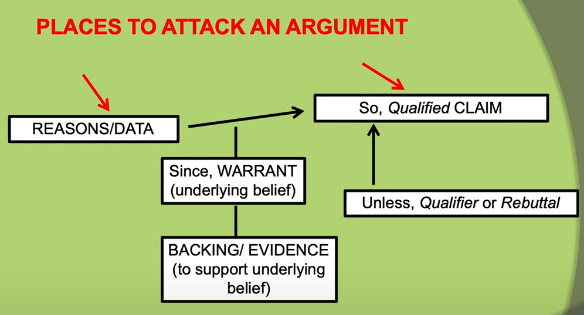
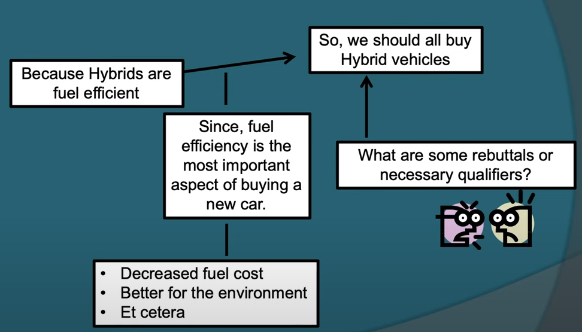

# Module 16

<!-- TOC -->
* [Module 16](#module-16)
* [General Notes](#general-notes)
* [Structural Aspect of Writing](#structural-aspect-of-writing)
  * [Structuring Arguments](#structuring-arguments)
  * [Toulmin Argument Model](#toulmin-argument-model)
    * [Toulmin Model Example](#toulmin-model-example)
<!-- TOC -->

# General Notes

> - [(Mis)Using Pronouns in Academic Writing](https://www.youtube.com/watch?v=Nal8ceLlde4&)

- Context trumps all, but try not to use second-person pronouns.
- Do not use first-person pronouns.
  - Making a statement implies that you are the one making the statement.
- Avoid vague pronouns

# Structural Aspect of Writing

- Organization, Arrangement, Sequencing
- Occurs at all levels of Writing
  - Word
  - Sentence
  - Paragraph
  - Section
  - Document
  - Genre level
- Syntax
  - Sentence 
  - Genres
  - Punctuation
- Paragraph
  - AXES
  - PIES
  - RICE
- So many genres.....
- Academic Essay/Argument Models

## Structuring Arguments

- **Classical model**
- **Rogerian model**
- **Toulmin model**
- **IMRAD**

## Toulmin Argument Model

Toulmin models should be able to back up their claims with evidence.

- It also focuses on accuracy and instead of saying "all", you'd be more accurate by saying "some".
- It makes sure that all pieces are there for an argument to be successful.
- THere are five key pieces, as seen in the image below.

'

- **Claim**
- **Qualifier**
- **Good Reasons**
- **Warrants**
- **Backing**
- **Evidence**
- **Authority**
- **Conditions of Rebuttal/Counterargument**
- **Response to Rebuttal/Counterargument**

### Toulmin Model Example

'

